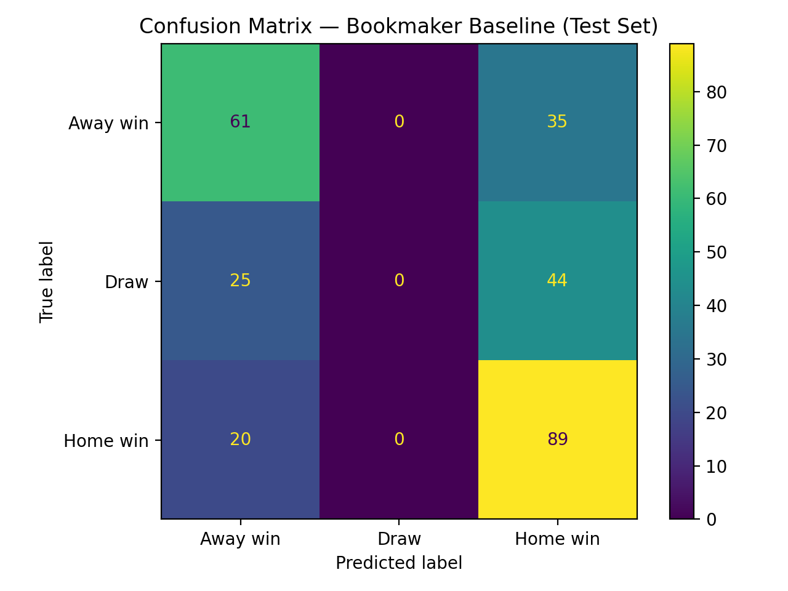
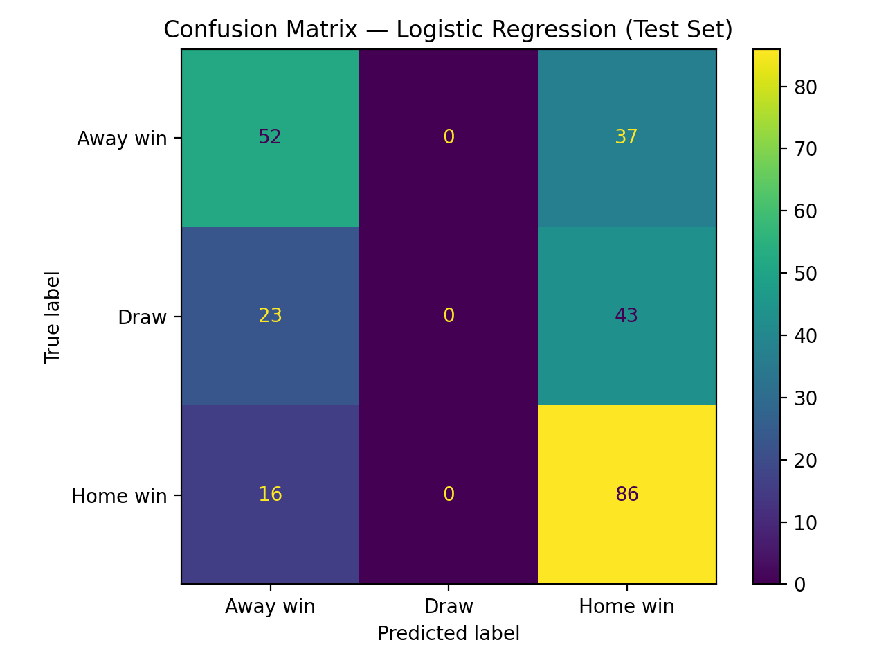
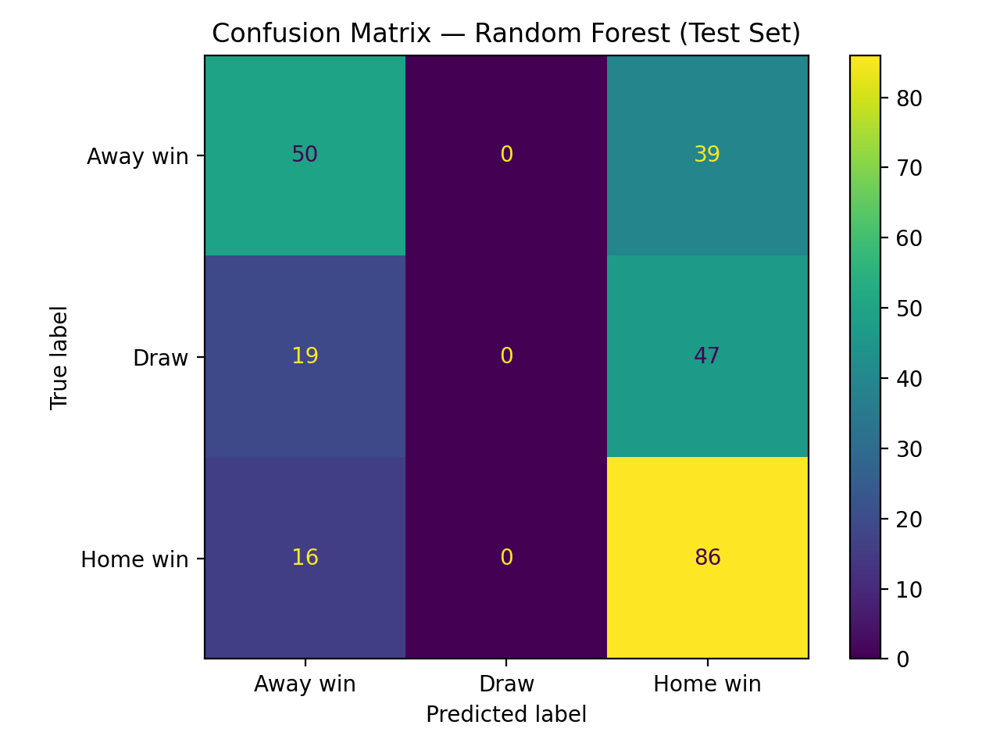

<!DOCTYPE html>
<html lang="en">
<head>
    <meta charset="utf-8">
    <meta http-equiv="X-UA-Compatible" content="IE=edge">
    <meta name="viewport" content="width=device-width, initial-scale=1">
    <title>English Premier League outcome Prediction | Advanced Programming 2025</title>
    <meta name="description" content="Course materials and resources for Advanced Programming at UNIL">
    <link rel="stylesheet" href="/course-materials/assets/css/style.css">
    <link rel="canonical" href="https://ap-unil-2025.github.io/course-materials/assets/templates/project_report_template_md.txt">
    
    <!-- Favicons -->
    <link rel="icon" type="image/svg+xml" href="/course-materials/favicon.svg">
    <link rel="icon" type="image/svg+xml" sizes="32x32" href="/course-materials/favicon-32x32.svg">
    <link rel="apple-touch-icon" href="/course-materials/apple-touch-icon.svg">
    <link rel="mask-icon" href="/course-materials/favicon.svg" color="#003aff">
    <meta name="theme-color" content="#003aff">
    
    <!-- Citation Metadata -->
    <meta name="citation_title" content="English Premier League outcome Prediction">
    <meta name="citation_author" content="Scheidegger, Simon">
    <meta name="citation_author" content="Smirnova, Anna">
    <meta name="citation_publication_date" content="2025">
    <meta name="citation_journal_title" content="HEC Lausanne Course Materials">
    <meta name="citation_public_url" content="https://ap-unil-2025.github.io/course-materials/assets/templates/project_report_template_md.txt">
    <meta name="citation_pdf_url" content="https://ap-unil-2025.github.io/course-materials/assets/course-materials.pdf">
    
    <!-- Dublin Core Metadata -->
    <meta name="DC.title" content="English Premier League outcome Prediction">
    <meta name="DC.creator" content="Simon Scheidegger">
    <meta name="DC.creator" content="Anna Smirnova">
    <meta name="DC.subject" content="Data Science">
    <meta name="DC.subject" content="Python Programming">
    <meta name="DC.subject" content="Machine Learning">
    <meta name="DC.subject" content="Statistical Learning">
    <meta name="DC.description" content="Advanced course introducing Python programming, statistical learning, and high-performance computing for Master's students in Economics and Finance">
    <meta name="DC.publisher" content="HEC Lausanne, University of Lausanne">
    <meta name="DC.date" content="2025-12-17">
    <meta name="DC.type" content="Course Materials">
    <meta name="DC.format" content="text/html">
    <meta name="DC.identifier" content="https://ap-unil-2025.github.io/course-materials/assets/templates/project_report_template_md.txt">
    <meta name="DC.language" content="en">
    <meta name="DC.rights" content="Creative Commons Attribution-ShareAlike 4.0 International License">
    
    <!-- Schema.org structured data for Google Scholar -->
    <script type="application/ld+json">
    {
      "@context": "https://schema.org",
      "@type": "Course",
      "name": "Data Science and Advanced Programming 2025",
      "description": "Advanced course introducing Python programming, statistical learning, and high-performance computing",
      "provider": {
        "@type": "Organization",
        "name": "HEC Lausanne, University of Lausanne",
        "sameAs": "https://www.unil.ch/hec/"
      },
      "instructor": [
        {
          "@type": "Person",
          "name": "Simon Scheidegger",
          "url": "https://sites.google.com/site/simonscheidegger/"
        },
        {
          "@type": "Person",
          "name": "Anna Smirnova"
        }
      ],
      "courseCode": "DSAP2025",
      "hasCourseInstance": {
        "@type": "CourseInstance",
        "courseMode": "https://schema.org/OnlineOnly",
        "startDate": "2025-09-15",
        "endDate": "2025-12-15",
        "location": {
          "@type": "Place",
          "name": "Internef 263",
          "address": {
            "@type": "PostalAddress",
            "addressLocality": "Lausanne",
            "addressCountry": "CH"
          }
        }
      },
      "license": "https://creativecommons.org/licenses/by-sa/4.0/"
    }
    </script>
    
    <!-- Begin Jekyll SEO tag v2.8.0 -->
<title>English Premier League outcome Prediction | Advanced Programming 2025</title>
<meta name="generator" content="Jekyll v4.3.4" />
<meta property="og:title" content="English Premier League outcome Prediction" />
<meta name="author" content="Your Name (your.email@unil.ch)" />
<meta property="og:locale" content="en_US" />
<meta name="description" content="Course materials and resources for Advanced Programming at UNIL" />
<meta property="og:description" content="Course materials and resources for Advanced Programming at UNIL" />
<link rel="canonical" href="https://ap-unil-2025.github.io/course-materials/assets/templates/project_report_template_md.txt" />
<meta property="og:url" content="https://ap-unil-2025.github.io/course-materials/assets/templates/project_report_template_md.txt" />
<meta property="og:site_name" content="Advanced Programming 2025" />
<meta property="og:type" content="article" />
<meta property="article:published_time" content="2025-12-01T00:00:00+00:00" />
<meta name="twitter:card" content="summary" />
<meta property="twitter:title" content="English Premier League outcome Prediction" />
<script type="application/ld+json">
{"@context":"https://schema.org","@type":"BlogPosting","author":{"@type":"Person","name":"Your Name (your.email@unil.ch)"},"dateModified":"2025-12-01T00:00:00+00:00","datePublished":"2025-12-01T00:00:00+00:00","description":"Course materials and resources for Advanced Programming at UNIL","headline":"Your Project Title Here","mainEntityOfPage":{"@type":"WebPage","@id":"https://ap-unil-2025.github.io/course-materials/assets/templates/project_report_template_md.txt"},"url":"https://ap-unil-2025.github.io/course-materials/assets/templates/project_report_template_md.txt"}</script>
<!-- End Jekyll SEO tag -->

</head>
<body>
    <header class="site-header">
        <div class="wrapper">
            <nav class="site-nav" role="navigation" aria-label="Main navigation">
    <div class="site-branding">
        <a class="site-title" href="/course-materials/" aria-label="Homepage">
            
            <span class="site-title-text">DSAP</span>
        </a>
        <a href="https://nuvolos.cloud" target="_blank" rel="noopener noreferrer" class="powered-by-header" aria-label="Powered by Nuvolos">
            <span class="powered-text">Powered by</span>
            
        </a>
    </div>
    
    <button class="nav-toggle" aria-label="Toggle navigation menu" aria-expanded="false">
        <span class="hamburger"></span>
        <span class="hamburger"></span>
        <span class="hamburger"></span>
    </button>
    
    <div class="nav-links" id="nav-links">
        <a href="/course-materials/" >Home</a>
        <a href="/course-materials/syllabus" >Syllabus</a>
        <a href="/course-materials/weekly-materials" >Weekly Materials</a>
        <a href="/course-materials/assignments" >Assignments</a>
        <a href="/course-materials/exercises" >Exercises</a>
        <a href="/course-materials/projects" >Projects</a>
        <a href="/course-materials/help-support" >Help & Support</a>
        <a href="/course-materials/citation" >Cite</a>
        
        
    </div>
</nav>

<script>
document.addEventListener('DOMContentLoaded', function() {
    const navToggle = document.querySelector('.nav-toggle');
    const navLinks = document.querySelector('.nav-links');
    
    if (navToggle && navLinks) {
        navToggle.addEventListener('click', function() {
            const isExpanded = navToggle.getAttribute('aria-expanded') === 'true';
            navToggle.setAttribute('aria-expanded', !isExpanded);
            navLinks.classList.toggle('active');
            document.body.classList.toggle('nav-open');
        });
        
        // Close menu when clicking outside
        document.addEventListener('click', function(event) {
            if (!navToggle.contains(event.target) && !navLinks.contains(event.target)) {
                navToggle.setAttribute('aria-expanded', 'false');
                navLinks.classList.remove('active');
                document.body.classList.remove('nav-open');
            }
        });
        
        // Close menu on escape key
        document.addEventListener('keydown', function(event) {
            if (event.key === 'Escape') {
                navToggle.setAttribute('aria-expanded', 'false');
                navLinks.classList.remove('active');
                document.body.classList.remove('nav-open');
            }
        });
    }
});
</script>

<style>
/* Make navigation more compact */
.site-nav {
    padding: 0.5rem 0;
}

.nav-links {
    gap: 0.75rem;
    font-size: 0.9rem;
}

.nav-links a {
    padding: 0.25rem 0.4rem;
}

.powered-by-header {
    gap: 0.3rem;
}

.powered-text {
    font-size: 0.75rem;
}

.header-nuvolos-logo {
    height: 20px;
}

.nav-toggle {
    display: none;
    background: none;
    border: none;
    cursor: pointer;
    padding: 0.5rem;
    flex-direction: column;
    gap: 0.25rem;
    z-index: 1001;
}

.hamburger {
    width: 24px;
    height: 2px;
    background-color: var(--text-primary);
    transition: all 0.3s ease;
    transform-origin: center;
}

.nav-toggle[aria-expanded="true"] .hamburger:nth-child(1) {
    transform: rotate(45deg) translate(6px, 6px);
}

.nav-toggle[aria-expanded="true"] .hamburger:nth-child(2) {
    opacity: 0;
}

.nav-toggle[aria-expanded="true"] .hamburger:nth-child(3) {
    transform: rotate(-45deg) translate(6px, -6px);
}

.nav-links a.active {
    color: var(--primary-color);
    font-weight: 600;
    background-color: rgba(59, 130, 246, 0.05);
}

/* Hide the underline pseudo-element completely */
.nav-links a::after {
    display: none !important;
}

.external-links {
    margin-left: 2rem;
    padding-left: 2rem;
    border-left: 1px solid var(--border-color);
}

.external-icon {
    font-size: 0.8em;
    opacity: 0.7;
    margin-left: 0.25rem;
}

@media (max-width: 768px) {
    .site-nav {
        position: relative;
    }
    
    .nav-toggle {
        display: flex;
    }
    
    .nav-links {
        position: absolute;
        top: 100%;
        left: 0;
        right: 0;
        background-color: var(--background-color);
        border: 1px solid var(--border-color);
        border-top: none;
        border-radius: 0 0 0.5rem 0.5rem;
        box-shadow: 0 4px 12px rgba(0, 0, 0, 0.1);
        flex-direction: column;
        gap: 0;
        padding: 1rem 0;
        transform: translateY(-10px);
        opacity: 0;
        visibility: hidden;
        transition: all 0.3s ease;
        z-index: 1000;
    }
    
    .nav-links.active {
        transform: translateY(0);
        opacity: 1;
        visibility: visible;
    }
    
    .nav-links a {
        padding: 0.75rem 1.5rem;
        display: block;
        color: var(--text-primary);
        border-bottom: 1px solid var(--border-color);
    }
    
    .nav-links a:last-child {
        border-bottom: none;
    }
    
    .nav-links a:hover {
        background-color: var(--surface-color);
    }
    
    .nav-links a::after {
        display: none;
    }
    
    .external-links {
        margin-left: 0;
        padding-left: 0;
        border-left: none;
        border-top: 1px solid var(--border-color);
        padding-top: 1rem;
        margin-top: 1rem;
    }
    
    body.nav-open {
        overflow: hidden;
    }
}
</style>
        </div>
    </header>

    <main class="page-content page-transition">
        <div class="wrapper page-wrapper">
            
            
            <article class="page">
    <header class="page-header">
        <h1 class="page-title">Your Project Title Here</h1>
        
        <p class="page-subtitle">Advanced Programming 2025 - Final Project Report</p>
        
    </header>

    <div class="page-content">
        
# Abstract

Predicting the outcome of football matches is challenging. The various aspects of the game from team performance, tactical choices to diverse situations all play an important role in the result. This project investigates whether historical match statistics are meaningful to predict the outcome of football matches of the English Premier League.
Using real Premier League data, a dataset was constructed from publicly available match statistics and bookmaker odds from season 2021/22 to 2024/25, representing approximately 1400 matches. The data preparation work included data cleaning, merging datasets, feature selection and the creation of recent form rolling indicator, capturing differences between home and away teams. Two machine learning models, Logistic Regression and Random Forest classifier, were implemented to estimate outcome probabilities. The performance of the model was evaluated using standard classification metrics such as accuracy, log loss and confusion matrix on unseen data. Moreover, predictions of the model were compared to the implied probabilities of bookmakers, which serve as a strong baseline reflecting aggregated market information. The results show that the models achieve reasonable predictive performance and capture meaningful relationships between match statistics and result, while still exhibiting limitations when compared to bookmaker probabilities.
This project outlines a full data science workflow, from data preparation to model evaluation, to examine if the outcome of a match can be predicted using historical match data, and how the probability estimates produced by machine learning models compare to those implied by bookmaker odds.

**Keywords:** data science, Python, machine learning, [add your keywords]

\newpage

# Table of Contents

1. [Introduction](#introduction)
2. [Literature Review](#literature-review)
3. [Methodology](#methodology)
4. [Results](#results)
5. [Discussion](#discussion)
6. [Conclusion](#conclusion)
7. [References](#references)
8. [Appendices](#appendices)

\newpage

# 1. Introduction

Football is the most recognized and the most well-known sport in the world. The English premier league is arguably the most entertaining and the best league in the world. But it is more than just an extremely popular sport, it is also a massive generator of publicly available data that has made football an attractive domain for computer science and machine learning applications for the analysis and the prediction of matches. Despite this load of information, the game remains challenging to forecast. The outcome of a match is difficult to predict due to the influence of many factors from the weather to detailed events in the match and even chance.

The main objective of this project is to investigate whether historical match statistics can be a good predictor of the results of the matches, defined as home win, away win or draw. The goal is not to produce a betting system or to outperform the bookmakers, it is to understand the relationship between performance indicators and the result. in this context, bookmakers’ odds are not viewed as a target to reach or even to beat, but as a sophisticated base of comparison that represent the intelligence of the market.

To address this problem a dataset was constructed using real match statistics such as goals, passing metrics, discipline and betting odds. The features used for the model were designed to capture relative differences between the home and away team, a common choice in football predictions. the features used include recent performance indicators, goal related metrics and advanced statistics, all averaged to a certain period to exclude data leakage. two machine learning models including logistic regression and random forest classifiers were used to estimate outcome probabilities based on these features.

This report walks through the entire process, from feature engineering and model training to a critical look at where statistical models succeed and where they fall short.

# 2. Literature Review

Predicting football match outcomes has long been a subject of interest in both statistics and data science and has evolved massively due to the increasing amount of data provided. In most studies the task has been formulated as a three possible outcome classification problem, home win, draw or away win. Football presents a particularly challenging prediction problem due to its inherent uncertainty, the high impact of random events, and the strong interdependence between competing teams. Therefore, even with well-designed models, perfect prediction is practically unattainable.

Early research on football prediction relied primarily on statistical model such as Poisson regression and goal-scoring processes. These approaches provided important foundations and introduced key assumptions about team strengths and match dynamics, but they often struggled to capture complex relationships between teams and contextual factors (1,2). More recent work has shifted towards machine learning models including Logistic Regression, Random Forest and Gradient Boosting models (3, 4, 8, 9) which are better suited to handle non-linear patterns and the large amount of data generated.

The difficulty of predicting draws is the main challenge of today’s research. Several studies report that machine learning models tend to perform well in two factors model while draws are often poorly predicted or entirely ignored by the model (6). This issue is commonly attributed to class imbalance ad draws occurs less than wins or losses. To address this problem, some researchers reformulate the prediction task as a binary classification problem, such as predicting home win versus non-home win, which has been shown to improve overall predictive performance (5).

Feature engineering plays a central role in football match prediction. Many studies highlight the importance of using features that are known prior to match kick-off in order to ensure realistic predictive scenarios (3, 19). 

The most common features used include aggregated match statistics from previous games, such as shots, goals, possession, and disciplinary records, often computed as averages over a fixed number of recent matches. In addition, advanced performance indicators such as expected goals have gained popularity, as they provide a more representative and predictive information than the goal (3,8). Another commonly adopted strategy is the use of relative features including differences in performances and in recent form and strength. By focusing on differences rather than absolute values, these metrics directly encode competitive balance and home advantage effects, which are known to influence match outcomes (7, 8, 11). Ratings derived from external sources, such as FIFA ratings or league rankings, are also frequently used as proxies for team strength and long-term performance (11).

Finally, bookmakers’ odds are often used as a benchmark for evaluating predictive models. They represent the intelligence of the market and aggregate a large amount of information making their probabilities and prediction difficult to outperform (12,13). Rather than trying to make profit on the bookmakers, several studies use bookmakers’ odds as a baseline to assess whether their models capture meaningful information beyond what ius already reflected in the market prices (13,14). 

Overall, existing research suggests that machine learning models can achieve reasonable predictive performance when applied to football match data, particularly when careful feature engineering and problem formulation are employed (3, 5, 10). However, limitations related to class imbalance, draw prediction, and model generalization remain significant. This project builds on prior work by adopting a structured machine learning approach, emphasizing relative performance features, probabilistic evaluation, and comparison to bookmaker-based baselines within an academic data science framework (6, 7, 18).

# 3. Methodology

## 3.1 Data Description

The datasets used include both raw and processed data covering Premier League seasons from 2021 up to January 2025. The data collection period ends in January 2025 due to the absemce of values in the records. The choice to focus on seasons from 2021 onward is motivated by the structural and tactical evolution of the Premier League in recent years. As the league has undergone noticeable changes in playing style and competitive dynamics, restricting the analysis to more recent seasons ensures greater relevance and consistency with the current football context.

The first raw dataset used in this project consists of historical football match data from the English Premier League, collected from publicly available football statistics sources and Kaggle, named matchdata_21-25.csv in the project. The data span multiple seasons, from 2021/22 to 2024/25 (January) and is structured at the match level, with each line corresponding to a single game from one team point of view, consisting of 1’369 games so 2738 lines. The dataset contains 152 columns with each one corresponding to a single match statistic, such as goals metrics, passing stats, advanced statistics such as xG, etc. The second part of raw datasets are 4 datasets, one of each season named 21_22, 22_23, 23_24 and 24_25 coming from the website football data.co.uk. This dataset contains match statistics combined with loads of bookmakers’ odds. Each line regards one single game from both home and away perspective. All these four are merged in all_matches.csv to contain every game of every season, until January 2025 to facilitate the merge and a match_id is also created for convenience. Only match statistics and certain odds are kept. Then, both processed data sets are merged using the match_id and processed to keep only the useful columns. The features in the dataset being known before the match, rolling statistics are created to keep only information known before the game. After data cleaning and preprocessing, the intermediate dataset (data_after_engineering.csv) contains 1’369 matches, one line per team for each match, so two lines per match, and a structured set of numerical features, including rolling features of match statistics such as avg_goals_for_L5, avg_xg_against_L5, avg_discipline_L5. Rolling features caused a loss of approximately 80 games to the model due to the absence of value for the first matches. Rolling features were restarted each start of the season and for the first 4 games the average was taken not on the last 5 games but on the number of games played before. The target variable is a categorical match outcome (target) with three classes: home win, draw, and away win, which is the standard multiclass setup in football prediction research (3, 5).

The model training set, (model_data.csv) is composed exclusively of variables available prior to kick-off, ensuring a realistic predictive setting. Each line corresponds to one game. Most of these features are computed as differences between the home and away teams, capturing relative strengths rather than absolute levels. These include differences in recent form indicators such as average points over the last 5 and 10 matches (diff_avg_points_L5, diff_avg_points_L10), offensive and defensive performance (diff_avg_goals_for_L5, diff_avg_goals_against_L5), clean sheet rates (diff_clean_sheet_rate_L5), expected goals metrics (diff_avg_xg_for_L5, diff_avg_xg_against_L5, diff_avg_xg_diff_L5), and goal difference (diff_avg_goal_diff_L5). The dataset further includes differences in match statistics such as shots on target (diff_avg_shots_on_target_for_L5, diff_avg_shots_on_target_against_L5), possession (diff_avg_possession_L5), saves (diff_avg_saves_L5), fouls (diff_avg_fouls_L5), yellow cards (diff_avg_yellow_cards_L5), blocks (diff_avg_blocks_L5), and clearances (diff_avg_clearances_L5). Contextual home/away form is also captured via features such as diff_avg_points_home_L5 and diff_avg_points_away_L5.

Crucially, as explained earlier, the dataset also includes bookmaker odds as market-based information available before kick-off. This includes three-way outcome odds for home win, draw, and away win (odds_win, odds_draw, odds_lose), as well as goal-market odds for over/under 2.5 goals (odds_over25, odds_under25). These variables are used as a strong benchmark reflecting aggregated public and expert information, and they serve as a baseline for comparison with model-predicted probabilities and are therefore not included in the model (12, 13).

## 3.2 Approach

This project adopts a supervised machine learning approach to predict football match outcomes. The task is formulated as a multiclass classification problem with three possible outcomes: home win, draw, and away win. This formulation is standard in the football prediction literature and reflects the natural structure of match results (3, 5).

### Algorithms

Two classification models are employed in this study: logistic regression and random forest. Logistic regression is used as a baseline machine learning model due to its simplicity, interpretability, and ability to produce well-calibrated probabilistic outputs. Its linear structure provides a transparent reference point and facilitates comparison with more flexible models.

Random forest is selected as a representative ensemble method based on decision trees. By aggregating predictions from multiple trees, the model is able to capture nonlinear relationships and complex interactions between features while remaining robust to noise and outliers (8, 9, 15). This makes random forest particularly suitable for heterogeneous football performance data composed of tactical, statistical, and market-based features.

Bookmaker odds are not used as the sole predictive objective and are not included as input features in the machine learning models. They are used separately as an external benchmark for comparison with model-predicted probabilities. Model predictions are explicitly compared against bookmaker-implied probabilities in order to contextualize model performance relative to market expectations (12, 13).

### Preprocessing

Data preprocessing consists of several steps applied uniformly across models. Observations with missing values are removed to ensure a consistent feature set. Rolling features were created to ensure models use only information available prior to kick-off. They were constructed in this manner:

```python 
df["avg_points_L5"] = g["points"].shift(1).rolling(5, min_periods=1).mean()
```

This example from the build_rolling_features function shows the arcitecture of the rolling features. It is a mean of the last five games, starting after the first game and if the numer of matche <5, taking the number of matches before to make the mean and also banning the actual match. This function allows the model to use only information available prior the match. The model uses data available in the file model_data and that is differences between home and away team. These features are created in this boucle:

```python 
for c in feature_cols:
out[f"diff_{c}"] = (
merged[f"{c}_home"] - merged[f"{c}_away"]
)
```

This boucle is taking the value from home and from away team and create a difference from all rolling features. Differences are mainly used in studies and are highly significant to predict match outcomes.

For logistic regression, numerical features are standardized to zero mean and unit variance to improve numerical stability and model convergence. For random forest, features are left unscaled, as tree-based models are invariant to monotonic transformations. No explicit outlier removal is performed, as ensemble tree models are generally robust to extreme values. Feature selection is guided by domain knowledge and correlation-based considerations (see tables in the code) in order to reduce redundancy and limit overfitting, following standard feature engineering practices in machine learning (18, 19).

### Model Architecture

The logistic regression model is used to estimate the probability of each possible match outcome: home win, draw, or away win. For every match, the model outputs a probability for each class and predicts the outcome with the highest probability. Regularization is applied to prevent the model from overfitting the training data and to improve its ability to generalize to unseen matches. The random forest model is an ensemble method composed of many decision trees trained on different subsets of the data. Each tree learns simple decision rules based on a random selection of features, which introduces diversity among the trees. The final prediction is obtained by averaging the probabilities produced by all trees, resulting in a more stable and robust prediction.

Both models are implemented using the scikit-learn library, which provides a consistent framework for model training, probability estimation, and evaluation. This ensures a fair comparison between models and facilitates reproducibility of the results.

### Evaluation Metrics

Model performance is evaluated using a combination of classification-based and probability-based metrics. Classification accuracy is first used to measure how often the predicted outcome matches the true match result. While accuracy provides an intuitive global indicator, it is not sufficient on its own due to the imbalanced distribution of football outcomes, with draws occurring less frequently than home or away wins. To address this limitation, the evaluation also focuses on predicted probabilities. Log loss is used to assess how well the probability distributions produced by the models reflect the actual match outcomes. This metric penalizes confident but incorrect predictions and therefore provides a more informative measure of probabilistic quality than accuracy alone. It is particularly well suited for comparison with bookmaker-implied probabilities, which are naturally expressed in probabilistic terms (6).

In addition to scalar metrics, results are summarized in a comparative performance table including accuracy and log loss for each model and for the bookmaker baseline. This table provides a clear and compact overview of relative model performance and highlights the small performance gap between machine learning models and the bookmaker benchmark. Performance is analysed both at an aggregate level and per outcome class using confusion matrices and classification reports. Special attention is given to the draw class, which remains difficult to predict across all approaches and represents a known limitation in football match outcome prediction (5, 10).

Finally, model predictions and bookmakers’ predictions are compared in the last result file, match_probabilities_comparison.csv to show that the model can predict certain match better than the bookmakers.

## 3.3 Implementation

The project is implemented entirely in Python, using standard data science libraries. Data manipulation and preprocessing are handled with pandas and numpy. Machine learning models are implemented using the scikit-learn library, which provides a unified interface for model training, probability estimation, and evaluation. Model persistence is managed with joblib, allowing trained models to be saved and reused in a consistent manner.

The overall system architecture follows a modular and reproducible pipeline design. Raw match data are first loaded and sorted chronologically to prevent information leakage. Relevant features are selected and validated to avoid redundance, after which the dataset is split chronologically into training and test sets (80/20) to avoid data leakage. Machine learning models are trained on the training set, evaluated on the test set, and stored together with evaluation outputs and metadata.

Main part of the project is the treatment of data including loading, standardizing, merging, feature selection and rolling features creation. Other key components of the implementation include scripts responsible for model training, evaluation, and result storage. Logistic regression is implemented using a pipeline that combines feature standardization and model fitting, ensuring that preprocessing steps are applied consistently. Random forest models are trained without feature scaling and provide feature importance scores that support model interpretation.

For each model, classification reports, confusion matrices, and probabilistic evaluation metrics are generated and saved to disk. Trained models and the list of features used during training are also stored, ensuring reproducibility and consistency between training and prediction phases. This implementation strategy follows the software engineering and reproducibility principles emphasized in the course.

# 4. Results

## 4.1 Experimental Setup

All experiments were conducted in a CPU-only environment on a standard personal computer. The implementation was carried out in Python using widely adopted data science libraries, notably pandas for data manipulation and scikit-learn for model training, preprocessing, and evaluation. The full training and evaluation procedure is reproducible and executed locally.
To avoid temporal leakage, matches were first sorted chronologically by match_date and then split into training and test sets using an 80/20 chronological split. Approximately 80% of the observations (1,027 matches) were used for training, while the remaining 20% (257 matches) were reserved for out-of-sample testing.

```python
df = df.sort_values("match_date")
split_idx = int(len(x) * 0.8)
```

For logistic regression, a multinomial formulation was used together with feature standardization via a StandardScaler. Model training relied on the LBFGS optimizer with an increased maximum number of iterations to ensure convergence. 

```python
log_reg = Pipeline([
    ("scaler", StandardScaler()),
    ("clf", LogisticRegression(
        solver="lbfgs",
        max_iter=2000,
        random_state=42
    ))
])
```

The random forest model was trained using 300 decision trees, with a minimum number of samples per leaf set to reduce overfitting. Default impurity-based splitting criteria were used.

```python
rf = RandomForestClassifier(
    n_estimators=300,
    min_samples_leaf=5,
    random_state=42,
    n_jobs=-1
)
```

No cross-validation or extensive hyperparameter tuning was performed, as the primary objective of the project is comparative and methodological rather than performance optimization.

## 4.2 Performance Evaluation

Model performance was evaluated using both classification accuracy and probabilistic metrics. In addition to the machine learning models, bookmaker-implied probabilities were included as a baseline benchmark. For comparability, bookmaker predictions were derived by selecting the most likely outcome (argmax) from the implied probability distribution.

Table 1 presents the predictive performance of the two machine learning models and the bookmaker baseline on the test set, evaluated using both classification accuracy and log-loss to capture not only correctness but also the quality of predicted probabilities.

| Model | Accuracy | Log-loss |
|-------|----------|----------|
| Logistic Regression | 0.5370 | 0.9988 |
| Random Forest | 0.5292 | 0.9984 |
| Bookmaker Baseline | 0.5474 | 0.9438 |
*Table 1: Predictive performance comparison on the test set*

All three approaches achieve similar performance, with results slightly above 53% accuracy. The bookmaker baseline marginally outperforms both machine learning models in terms of accuracy and log-loss, confirming its role as a strong reference point.
Class-level evaluation reveals a systematic difficulty in predicting draw outcomes. Both machine learning models almost never predict the draw class correctly, a limitation that is also observed in the bookmaker baseline. In contrast, home wins and away wins are predicted with substantially higher recall, especially for home wins. These results highlight the inherent class imbalance of football match outcomes and confirm findings reported in prior literature regarding the difficulty of draw prediction.

## 4.3 Visualizations

To complement aggregate performance metrics, confusion matrices were used to analyze class-level prediction behavior for each approach. These visualizations provide insight into how models distribute their errors across outcome classes and help identify systematic weaknesses that are not captured by accuracy alone.

#### Confusion Matrices

Figure 1 presents the confusion matrix of the bookmaker baseline on the test set. Although bookmaker probabilities are used as a benchmark rather than a trained model, converting the highest implied probability into a predicted class allows a direct comparison with machine learning approaches. The bookmaker baseline correctly predicts a substantial number of home and away wins but, similarly to the machine learning models, fails to correctly classify draw outcomes. Draws are consistently misclassified as either home or away wins, highlighting the inherent difficulty of this class.



Figure 2 shows the confusion matrix of the logistic regression model. The model performs reasonably well for home wins and away wins, with a strong bias toward predicting decisive outcomes. However, no draw is correctly predicted. All draw matches are absorbed into the home win or away win categories. This behavior reflects both class imbalance and the limitations of linear decision boundaries when modeling marginal match situations.



Figure 3 presents the confusion matrix of the random forest model. Despite its ability to capture non-linear relationships and interactions between features, the random forest exhibits a very similar error structure to logistic regression. Home wins and away wins are predicted with comparable accuracy, while draw outcomes are never correctly classified. This result suggests that the difficulty in predicting draws is structural and not resolved by increased model complexity.



Across all three approaches, misclassifications predominantly occur between home wins and away wins, while draw outcomes are systematically misclassified as one of the two win categories. This pattern is consistent with prior findings in football match prediction research and reflects the marginal nature of draws, which often arise from finely balanced matches and stochastic in-game events that are difficult to capture using aggregated pre-match statistics.

#### Probabilistic Interpretation

Beyond classification behavior, model predictions were also analyzed from a probabilistic perspective. In a match-level comparison, the logistic regression model assigned a higher probability to the realized outcome than the bookmaker baseline in 99 out of 257 matches (38.5%). While this does not translate into superior overall performance, it indicates that the model captures complementary information in a non-negligible subset of matches.

Importantly, this analysis is not intended to demonstrate systematic superiority over bookmakers, but rather to illustrate how probabilistic machine learning models may express uncertainty differently from market-based forecasts. In particular, model predictions tend to distribute probability mass more evenly across outcomes in closely balanced matches, whereas bookmaker probabilities are often more concentrated on a single result.

# 5. Discussion

The results of this project provide several insights into the effectiveness and limitations of machine learning approaches for football match outcome prediction. Overall, the proposed methodology demonstrates that a structured and well-designed pipeline can extract meaningful information from historical match data, even in a domain characterized by high uncertainty.

One aspect that worked particularly well is the overall modelling framework. The use of relative, difference-based features capturing recent team performance proved effective in distinguishing home wins from away wins. Both logistic regression and random forest models produced stable probabilistic predictions and achieved performance levels comparable to the bookmaker baseline. In this context, matching bookmaker accuracy should be considered a positive result, as bookmaker odds aggregate expert knowledge and market information and are widely recognized as a strong benchmark.

Several challenges were encountered during the project, the most prominent being the difficulty of predicting draw outcomes. Both machine learning models almost entirely failed to predict draws correctly, a limitation that was also observed in the bookmaker baseline. This issue is primarily due to class imbalance and the fact that draws often arise from marginal or random match events that are difficult to capture using aggregated team-level statistics. Rather than attempting to artificially rebalance classes or modify the prediction task, this limitation was addressed through careful interpretation of the results and class-level performance analysis.

The observed results are largely consistent with the initial expectations of the project. It was hypothesized that machine learning models based on publicly available, team-level features would achieve moderate predictive performance but would struggle to consistently outperform bookmakers. The results confirm this hypothesis, as both models perform slightly below or at a similar level to the bookmaker baseline in terms of accuracy and log loss. Likewise, the persistent difficulty in draw prediction aligns with findings commonly reported in the literature.

Despite the use of a more complex model, random forest did not significantly outperform logistic regression. This highlights an important limitation of the current approach: increasing model complexity does not necessarily lead to better performance when the feature set is limited. The models rely exclusively on aggregated historical statistics and do not account for important contextual factors such as player availability, injuries, tactical decisions, or in-game dynamics. In addition, no advanced calibration techniques or extensive hyperparameter tuning were applied, as the primary focus of the project was methodological clarity rather than performance optimization.

One somewhat surprising finding is that, although the models do not outperform the bookmaker baseline overall, the logistic regression model assigns a higher probability to the realized outcome than the bookmaker in approximately 38.5% of matches. This suggests that the model captures complementary information and occasionally disagrees with the market in a meaningful way, even if this is insufficient to achieve consistent superiority. This result highlights the potential value of probabilistic analysis beyond simple accuracy comparisons.

In summary, the discussion of the results reinforces the idea that football match prediction is inherently difficult and that moderate performance levels should be expected when relying on historical, aggregated data. The project successfully demonstrates a sound data science workflow, provides realistic insights into the strengths and weaknesses of machine learning models in this domain, and aligns well with both the course objectives and existing research.

# 6. Conclusion

## 6.1 Summary

This project investigated the application of machine learning techniques to football match outcome prediction using historical data from the English Premier League. A complete and reproducible data science pipeline was developed, covering data preparation, feature engineering, model training, evaluation, and comparison with bookmaker-based baselines.

The main achievement of the project is the successful implementation of a structured predictive framework using logistic regression and random forest models. Both models achieved performance levels comparable to bookmaker predictions, demonstrating that relative, team-level performance features capture meaningful information about match outcomes. The project also highlighted the importance of probabilistic evaluation, showing that model outputs can be meaningfully compared to bookmaker-implied probabilities.

The project objectives were fully met. Rather than attempting to outperform betting markets, the work focused on methodological clarity, realistic evaluation, and critical interpretation of results. The findings contribute to a better understanding of the strengths and limitations of machine learning approaches in football analytics and align well with established results in the literature.

## 6.2 Future Work

Several directions could be explored to extend and improve this work. From a methodological perspective, future research could investigate alternative modeling approaches, such as calibrated ensemble methods or hierarchical models, to better handle class imbalance and improve draw prediction. Incorporating probability calibration techniques may also enhance the quality of predicted probabilities.

Additional experiments could include expanding the feature set to incorporate player-level information, injuries, squad rotation, or tactical variables, which are known to influence match outcomes. Evaluating the models across multiple leagues or longer time periods could also provide insights into their generalizability and robustness.

From an applied perspective, the framework developed in this project could be adapted for real-world use in match analysis or decision-support systems, where probabilistic forecasts are more valuable than deterministic predictions. Finally, scalability considerations could involve automating data updates and extending the pipeline to handle larger datasets or real-time prediction scenarios.

Finally, while this study focuses exclusively on the English Premier League, the proposed methodology is not league-specific and could be generalized to a broader set of competitions. Applying the same pipeline to multiple leagues would allow for comparative analyses across different football contexts, styles of play, and competitive structures. Such an extension could help assess the robustness and generalizability of the modeling approach, as well as identify league-dependent patterns in match outcome prediction. This multi-league perspective would further strengthen the validity of the findings and provide a more comprehensive understanding of the applicability of machine learning methods in football analytics.

# References

1. Dixon, M. J., & Coles, S. G. (1997). *Modelling association football scores and inefficiencies in the football betting market*. Journal of the Royal Statistical Society: Series C (Applied Statistics), 46(2), 265–280.

2. Maher, M. J. (1982). *Modelling association football scores*. Statistica Neerlandica, 36(3), 109–118.

3. Baboota, R., & Kaur, H. (2019). *Predictive analysis and modelling football results using machine learning*. International Journal of Forecasting, 35(2), 741–755.

4. Bunker, R. P., & Thabtah, F. (2019). *A machine learning framework for sport result prediction*. Applied Computing and Informatics, 15(1), 27–33.

5. Bunker, R. P., & Susnjak, T. (2022). *Machine learning techniques for predicting match results in team sport: A review*. IEEE Access, 10, 25193–25212.

6. Constantinou, A. C., & Fenton, N. E. (2012). *Solving the problem of inadequate scoring rules for probabilistic football forecasts*. Journal of Quantitative Analysis in Sports, 8(2).

7. Constantinou, A. C., & Fenton, N. E. (2013). *Determining team ability using dynamic ratings*. Journal of Quantitative Analysis in Sports, 9(4), 379–392.

8. Groll, A., Schauberger, G., & Tutz, G. (2018). *Prediction of the FIFA World Cup 2018 – A random forest approach*. Journal of Quantitative Analysis in Sports, 15(3), 1–15.

9. Groll, A., Schauberger, G., & Tutz, G. (2019). *A hybrid random forest to predict soccer matches*. Statistical Modelling, 19(2), 123–146.

10. Tsokos, A., et al. (2019). *Modeling outcomes of soccer matches*. Machine Learning, 108(1), 1–24.

11. Hvattum, L. M., & Arntzen, H. (2010). *Using Elo ratings for match result prediction in association football*. International Journal of Forecasting, 26(3), 460–470.

12. Forrest, D., Goddard, J., & Simmons, R. (2005). *Odds-setters as forecasters*. International Journal of Forecasting, 21(3), 551–564.

13. Štrumbelj, E., & Šikonja, M. R. (2010). *Online bookmakers’ odds as forecasts: The case of European soccer leagues*. International Journal of Forecasting, 26(3), 482–488.

14. Wheatcroft, E. (2020). *A profitable model for predicting the over/under market in football*. Journal of Sports Analytics, 6(2), 89–103.

15. Breiman, L. (2001). *Random forests*. Machine Learning, 45(1), 5–32.

16. Chen, T., & Guestrin, C. (2016). *XGBoost: A scalable tree boosting system*. Proceedings of the 22nd ACM SIGKDD International Conference on Knowledge Discovery and Data Mining, 785–794.

17. Ke, G., et al. (2017). *LightGBM: A highly efficient gradient boosting decision tree*. Advances in Neural Information Processing Systems (NeurIPS), 30, 3146–3154.

18. Hall, M. A. (1999). *Correlation-based feature selection for machine learning*. PhD Thesis, University of Waikato.

19. Zheng, A., & Casari, A. (2018). *Feature engineering for machine learning: Principles and techniques for data scientists*. O’Reilly Media.

20. Lundberg, S. M., & Lee, S. I. (2017). *A unified approach to interpreting model predictions*. Advances in Neural Information Processing Systems (NeurIPS), 30, 4765–4774.

21. Van Wijk, D. (2020). *Machine learning approaches for football match outcome prediction*. Master’s Thesis, Erasmus University Rotterdam. Available at:  
   https://thesis.eur.nl/pub/59277/Final-Thesis-Dion-van-Wijk-477793-.pdf

22. Mendel Journal. (2017). *Machine learning approaches in football analytics*. Available at:  
   https://mendel-journal.org/index.php/mendel/article/view/263/217


# Appendices

## Appendix A: Additional Results

## Appendix A: Additional Results

This appendix presents supplementary results that support the main findings of the study but are not essential to the core narrative of the report. These additional analyses provide further detail on class-level performance, feature relevance, and probabilistic behavior of the models.

### A.1 Detailed Classification Reports

Table A1 reports the full classification metrics (precision, recall, and F1-score) for the logistic regression, random forest models and the bookmaker baseline on the test set. These results complement the accuracy and log-loss metrics presented in Section 4 by providing a more granular, class-level evaluation.

Logistic regression report : 
```{.text include="results/logistic_regression_report.txt"}```

Random forest report :
```{.text include="results/random_forest_report.txt"}```


Bookmakers report :
```{.text include="results/bookmaker_baseline_report.txt"}```

These detailed reports are provided for completeness and transparency and support the discussion presented in Section 5 regarding class imbalance and model limitations.

### A.2 Logistic Regression coefficients and Random Forest features importance

### A.2 Model Interpretability: Coefficients and Feature Importance

This section provides additional interpretability results for both machine learning models.

```{.text include="results/logistic_regression_coefficients.txt"}```

For logistic regression, model coefficients are reported for each outcome class in a one-vs-rest formulation.

```{.text include="results/random_forest_feature_importance.txt"}```

For the random forest model, feature importance scores based on impurity reduction are presented.


## Appendix B: Code Repository

**GitHub Repository:** https://github.com/noahgrande/epl-outcome-prediction.git

### Repository Structure

```
project-repo/
├── README.md
├── requirements.txt
├── data/
│   ├── raw/
│   └── processed/
├── src/
│   ├── preprocessing.py
│   ├── models.py
│   └── evaluation.py
├── notebooks/
│   └── exploration.ipynb
└── results/
    └── figures/
```

### Installation Instructions

```bash
git clone https://github.com/yourusername/project-repo
cd project-repo
pip install -r requirements.txt
```

### Reproducing Results

```bash
python src/main.py --config config.yaml
```

---

*Note: This report should be exactly 10 pages when rendered. Use the page count in your PDF viewer to verify.*

---

## Conversion to PDF

To convert this Markdown file to PDF, use pandoc:

```bash
pandoc project_report.md -o project_report.pdf --pdf-engine=xelatex
```

Or with additional options:

```bash
pandoc project_report.md \
  -o project_report.pdf \
  --pdf-engine=xelatex \
  --highlight-style=pygments \
  --toc \
  --number-sections
```
    </div>
</article>
        </div>
    </main>

    <footer class="site-footer">
        <div class="wrapper">
            <p class="license">
                <a rel="license" href="http://creativecommons.org/licenses/by-sa/4.0/">
                    
                </a>
                This work is licensed under a <a rel="license" href="http://creativecommons.org/licenses/by-sa/4.0/">Creative Commons Attribution-ShareAlike 4.0 International License</a>.
            </p>
            <p class="citation">
                <strong>Cite as:</strong> Scheidegger, S., & Smirnova, A. (2025). <em>Data Science and Advanced Programming 2025</em>. HEC Lausanne, University of Lausanne. 
                <a href="/course-materials/citation">View citation formats →</a>
            </p>
            <p class="credits">Made with 💙 by Anna Smirnova, Prof. Simon Scheidegger, and Claude 🤖</p>
            <p class="powered-by">
                <a href="https://nuvolos.cloud" target="_blank" style="display: inline-flex; align-items: center; gap: 0.5rem; color: inherit; text-decoration: none;">
                    Powered by
                    
                </a>
            </p>
        </div>
    </footer>

    <!-- Smooth Page Transitions -->
    <style>
    /* No CSS transitions - just AJAX navigation */
    
    /* Smooth scrolling for same-page links */
    html {
        scroll-behavior: smooth;
    }
    
    /* Removed underline animation - clean hover effect only */
    </style>

    <script>
    // Smooth SPA-style navigation
    document.addEventListener('DOMContentLoaded', function() {
        const pageContent = document.querySelector('.page-wrapper');
        const navLinks = document.querySelectorAll('.nav-links a');
        
        // Handle navigation clicks with AJAX
        navLinks.forEach(link => {
            // Skip external links
            if (link.hostname !== window.location.hostname) {
                return;
            }
            
            link.addEventListener('click', function(e) {
                e.preventDefault();
                
                const url = this.href;
                const currentPath = window.location.pathname;
                
                // Skip if same page
                if (url === window.location.href) {
                    return;
                }
                
                // Fetch new page content
                fetch(url)
                    .then(response => response.text())
                    .then(html => {
                        // Parse the new page
                        const parser = new DOMParser();
                        const newDoc = parser.parseFromString(html, 'text/html');
                        const newContent = newDoc.querySelector('.page-wrapper');
                        const newTitle = newDoc.querySelector('title');
                        
                        // Update content instantly
                        if (newContent) {
                            pageContent.innerHTML = newContent.innerHTML;
                            
                            // Re-execute any script tags in the new content
                            const scripts = pageContent.querySelectorAll('script');
                            scripts.forEach(script => {
                                const newScript = document.createElement('script');
                                if (script.src) {
                                    newScript.src = script.src;
                                } else {
                                    newScript.textContent = script.textContent;
                                }
                                script.parentNode.replaceChild(newScript, script);
                            });
                        }
                        if (newTitle) {
                            document.title = newTitle.textContent;
                        }
                        
                        // Update URL without reload
                        history.pushState({}, '', url);
                        
                        // Update active navigation
                        updateActiveNav(url);
                        
                        // Scroll to top
                        window.scrollTo({ top: 0, behavior: 'smooth' });
                    })
                    .catch(error => {
                        console.log('AJAX failed, falling back to normal navigation');
                        window.location.href = url;
                    });
            });
        });
        
        // Handle browser back/forward
        window.addEventListener('popstate', function() {
            window.location.reload();
        });
        
        // Update active navigation state
        function updateActiveNav(currentUrl) {
            navLinks.forEach(link => {
                link.classList.remove('active');
                if (link.href === currentUrl || 
                    (currentUrl.includes('/week/') && link.href.includes('/weekly-materials'))) {
                    link.classList.add('active');
                }
            });
        }
        
        // Initial active state
        updateActiveNav(window.location.href);
    });
    </script>
</body>
</html